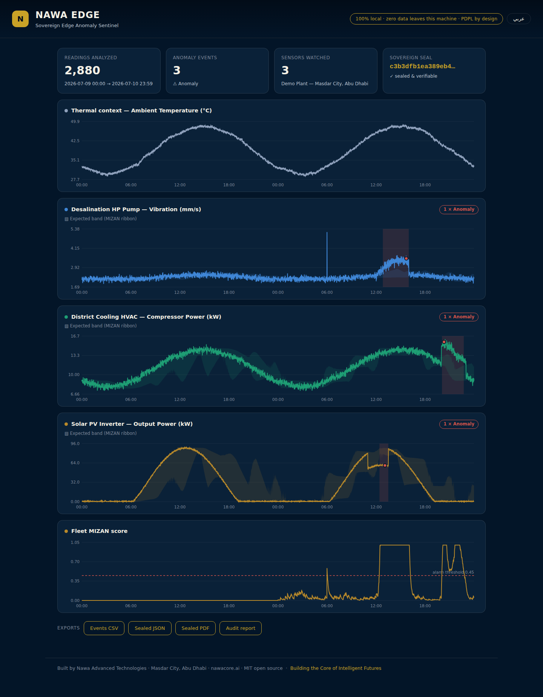
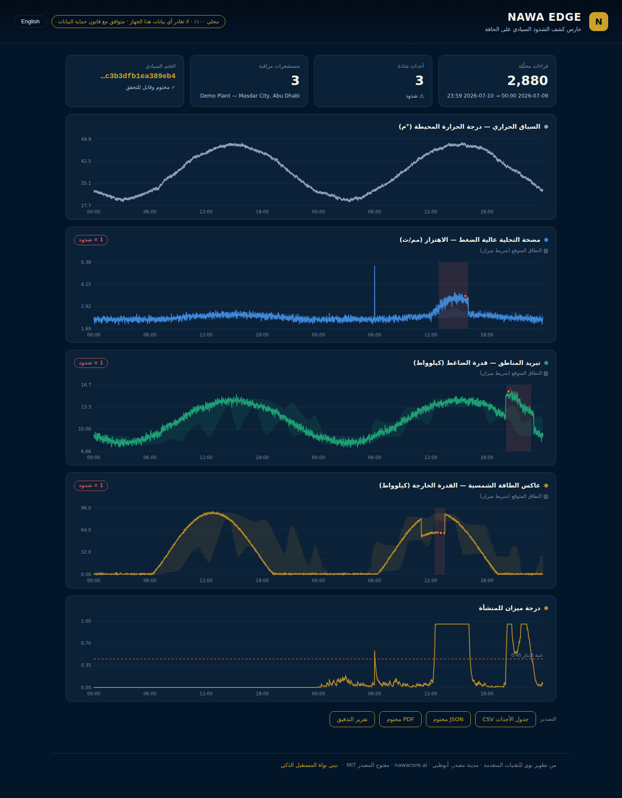

<div align="center">

# Nawa Edge

### The Sovereign Edge Anomaly Sentinel

**One file. Zero dependencies. Zero data leaves your machine.**

*Trusted Intelligence. Built for the Real World. — Nawa Advanced Technologies*

[](LICENSE)
[](https://python.org)
[](requirements.txt)
[](https://nawacore.ai)



</div>

---

## Run it in 30 seconds

```bash
git clone https://github.com/NawaCore/nawa-edge && cd nawa-edge
python nawa_edge.py
```

That's it. No `pip install`. No account. No cloud. No telemetry. Nawa Edge generates a
UAE-realistic 48-hour demo plant (a desalination high-pressure pump, a district-cooling
HVAC compressor under a 48 °C afternoon, and a solar PV inverter), detects three injected
faults with **zero false alarms in the bundled synthetic demonstration**, silently absorbs a single-tick dust "mirage", and opens
a bilingual (English/العربية) dashboard at `http://127.0.0.1:8742` — bound to localhost only.

Then run it on **your** data:

```bash
python nawa_edge.py detect your_plant.csv --context-col ambient_c --site "Plant 7, Ruwais"
python nawa_edge.py verify nawa_edge_out/nawa_edge_seals.jsonl    # offline audit verification
```

Your CSV just needs a `timestamp` column, an optional ambient-temperature column
(auto-detected), and any number of numeric sensor columns. Full details in the
[Engineer's Manual](MANUAL.md).

---

## Why Nawa Edge exists

Critical-infrastructure operators in the Gulf face a false choice: send OT sensor data
to an external cloud (which may create sovereignty, privacy, and attack-surface
concerns), or procure a complex on-premises analytics stack. Meanwhile generic,
context-blind detectors can produce nuisance alarms, because in this climate **"abnormal" is a function of the heat**: a compressor
drawing 14 kW is healthy at 47 °C and sick at 33 °C.

Nawa Edge is the third option: a genuinely free, genuinely local sentinel that treats
the desert as a first-class citizen of the model.

## The MIZAN-SARAB engine

Named for **ميزان** (*mizan*, "the balance") and **سراب** (*sarab*, "the mirage").

**MIZAN — thermally-woven quantile ribbons.** Each sensor's "normal" is tracked
separately per *context zone* — the cross of a thermal bin (e.g. <33 °C, 33–39, 39–45,
>45 °C) and a diurnal phase (3-hour buckets). Inside each zone, a streaming quantile
ribbon (q05 / q50 / q95) is maintained with Robbins–Monro updates and exponential
forgetting: **O(1) memory and CPU per reading, no training phase, no raw data
retained** — only sufficient statistics ever live in memory. Zone memberships are
*soft* (fuzzy-blended near every boundary), which eliminates the boundary-flicker
false alarms that plague binned baselines. Young zones borrow their baseline from the
sensor's global ribbon and *earn* independence as evidence accumulates — so Nawa Edge
is useful within hours, not weeks.

**SARAB — the mirage gate.** The desert lies: dust hits, thermal transients, and EMI
produce spectacular single-tick spikes. An alarm requires **all** of: a persistent
exceedance memory above threshold (EWMA), a minimum run of consecutive out-of-ribbon
readings, *and* zone confidence (a state of the world the engine has never lived
through is learned silently, never alarmed on — day one is for listening). One-tick
mirages are absorbed; sustained faults flash red in minutes.

**The integrity gate.** While a reading sits outside a mature zone's own ribbon, that
zone learns at 5 % speed — the engine refuses to learn the fault as the new normal,
even when a blended band was momentarily diluted by a young neighbor.

On the bundled demo, MIZAN-SARAB detects a pump-bearing ramp, a refrigerant-loss
overconsumption, and a solar soiling drop — **3/3 faults, 0 false positives across
random seeds** — while a context-blind z-score alarms on every hot afternoon.

*Honesty note: the building blocks (streaming quantiles, EWMA persistence) are
classical; what we claim as original is this specific weave — soft thermo-diurnal
zoning + confidence-gated ribbons + the mirage/integrity gates — packaged this simply.
If you find prior art, open an issue; we'll cite it prominently.*

## The Sovereign Seal (Silsila chain)

Every report is canonically serialized, SHA-256 hashed, and chained to the previous
seal in a local, append-only `nawa_edge_seals.jsonl` — a cryptographic chain of
custody with dual UTC + Gulf timestamps and a pseudonymous host fingerprint. Export it
as a **sealed PDF** (written by a built-in, dependency-free PDF engine), sealed JSON,
or a bilingual audit report — tamper-evident integrity records for engineering, audit, and assurance workflows
that never touched a network. Acceptance and regulatory compliance depend on the wider
operating process; see [DISCLAIMER.md](DISCLAIMER.md). Anyone can re-verify offline:

```bash
python nawa_edge.py verify nawa_edge_out/nawa_edge_seals.jsonl --report nawa_edge_out/nawa_edge_report_sealed.json
```

Tamper with a single digit and verification fails.

## What you get

| Artifact | Description |
|---|---|
| `dashboard.html` | Bilingual (EN/عربي) dashboard — MIZAN ribbons, anomaly shading, crosshair tooltips |
| `nawa_edge_events.csv` | Anomaly events table (start, end, peak score, thermal zone) |
| `nawa_edge_report_sealed.json` | Machine-readable report + Sovereign Seal |
| `nawa_edge_report_sealed.pdf` | Sealed audit PDF — zero dependencies, air-gap friendly |
| `nawa_edge_audit_report.html` | Bilingual print-ready audit report |
| `nawa_edge_seals.jsonl` | The Silsila seal chain (append-only) |

<div align="center">

</div>

## CLI reference

```
python nawa_edge.py                      # demo + dashboard (default)
python nawa_edge.py demo --csv-only      # just write the sample dataset
python nawa_edge.py detect DATA.csv      # your data
    --time-col timestamp                 # time column name
    --context-col ambient_c              # thermal context (auto-detected if omitted)
    --site "Name"                        # report site name
    --sensitivity low|medium|high        # alarm threshold preset
    --out nawa_edge_out --port 8742      # output folder / port
    --no-serve --no-browser              # headless / CI modes
python nawa_edge.py verify CHAIN.jsonl [--report REPORT.json]
```

## Design guarantees

- **Sovereign by default** — the web server binds to `127.0.0.1` only; there is no
  outbound call anywhere in the code. Read it: it's one file.
- **Local-processing by design** — raw readings are not transmitted by the tool; only
  streaming quantile statistics exist in detector memory. This can support PDPL-aligned
  architectures but does not, by itself, establish legal compliance.
- **Air-gap native** — runs on any Python ≥ 3.9, including machines that have never
  seen the internet. Even the PDF export is dependency-free.
- **Auditable** — deterministic given data + config; every claim sealed and re-verifiable.
- **Free forever** — MIT. No accounts, no tiers, no dark patterns.

Nawa Edge is the free core of the **Nawa Industrial** pillar at
[Nawa Advanced Technologies](https://nawacore.ai) — alongside Nawa Trust (sovereign AI
assurance) and Nawa Agents (enterprise agents). If you need fleet-scale deployment,
OPC-UA/Modbus connectors, sovereign AI agents on top of Edge signals, or managed
assurance — talk to us: **info@nawacore.ai**.

---

<div dir="rtl" align="right">

## Nawa Edge — حارس كشف الشذوذ السيادي على الحافة

أداة مجانية مفتوحة المصدر (رخصة MIT) لكشف الشذوذ في البنية التحتية الحرجة — محطات
تحلية المياه، تبريد المناطق، الطاقة الشمسية، المطارات، مراكز البيانات — تعمل محليًا
بالكامل على أي جهاز بلغة بايثون فقط، دون سحابة ودون إنترنت، بما يدعم السيادة
الرقمية وبُنى المعالجة المحلية. ولا تُعد الأداة بمفردها ضمانًا قانونيًا للامتثال.

يعتمد محرك <b>«ميزان-سراب»</b> على تعلّم «الطبيعي» لكل سياق حراري-يومي (فما يكون
طبيعيًا عند ٤٨° ظهرًا يختلف عنه عند ٣٣° فجرًا)، مع بوابة تمنع الإنذارات الكاذبة
الناتجة عن الغبار والقفزات اللحظية. وكل تقرير يُختم بسلسلة تجزئة SHA-256 محلية
(<b>الختم السيادي</b>) قابلة للتحقق دون اتصال — سجل سلامة قابل للتحقق لدعم أعمال الهندسة والتدقيق والحوكمة، ولا يغادر
الجهاز أبدًا. لوحة التحكم كاملة بالعربية والإنجليزية.

<div dir="ltr">

```bash
python nawa_edge.py
```

</div>

من تطوير <a href="https://nawacore.ai">نوى للتقنيات المتقدمة</a> — مدينة مصدر،
أبوظبي. «نبني نواة المستقبل الذكي»

</div>

---

<div align="center">

**Built with conviction in Masdar City, Abu Dhabi 🇦🇪**

MIT © 2026 Nawa Advanced Technologies Limited (MC 14734) · [nawacore.ai](https://nawacore.ai)

Code is MIT-free; the names are not — see [TRADEMARKS.md](TRADEMARKS.md).

</div>
